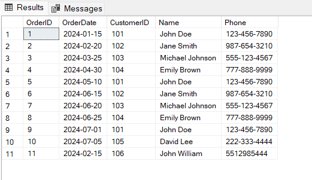

1. Write an SQL query to retrieve the names and emails of all customers.

```sql
select concat(FirstName,' ' , LastName) as Names  , Email
from Customers
```


2. Write an SQL query to list all orders with their order dates and corresponding customer names.

```sql
select OrderID ,OrderDate , concat(FirstName,' ', LastName) as Customer_Names
from Customers
join Orders
on Customers.CustomerID=Orders.CustomerID;
```


3. Write an SQL query to insert a new customer record into the "Customers" table. Include customer information such as name, email, and address.

```sql
Insert Into Customers Values (106,'John','William','john.william@example.com',5512985444,'5th Avenue Bourbon Street');
select * from Customers;
```


4. Write an SQL query to update the prices of all electronic gadgets in the "Products" table by increasing them by 10%.

```sql
UPDATE Products
SET Price = Price * 0.1 + Price
select * from Products
```


5. Write an SQL query to delete a specific order and its associated order details from the "Orders" and "OrderDetails" tables. Allow users to input the order ID as a parameter.

```sql
DECLARE @OrderId_delete INT;
SET @OrderId_delete=2;

Delete from OrderDetails
where OrderID=@OrderId_delete

Delete from Orders
where OrderID=@OrderId_delete

select * from Orders
select * from OrderDetails
```

6. Write an SQL query to insert a new order into the "Orders" table. Include the customer ID, order date, and any other necessary information.

```sql
Insert into Orders values (11,106,'2024-02-15',900.00)
select * from Orders
```


7. Write an SQL query to update the contact information (e.g., email and address) of a specific customer in the "Customers" table. Allow users to input the customer ID and new contact information.

```sql
DECLARE @CustomerID INT;
DECLARE @NewEmail VARCHAR(50);
DECLARE @NewAddress VARCHAR(50);

UPDATE Customers
set Email=@NewEmail ,
Address = @NewAddress
where CustomerID=@CustomerID
select * from Customers
```

8. Write an SQL query to recalculate and update the total cost of each order in the "Orders" table based on the prices and quantities in the "OrderDetails" table.

```sql

update Orders
set TotalAmount=(
select sum(Quantity * Price )
from OrderDetails
join Products
on OrderDetails.ProductID=Products.ProductID
where OrderDetails.OrderID=Orders.OrderID
);
```


9. Write an SQL query to delete all orders and their associated order details for a specific customer from the "Orders" and "OrderDetails" tables. Allow users to input the customer ID as a parameter.

```sql
Delete from OrderDetails
where OrderID IN (
select OrderID
from Orders
where CustomerID=@CustomerID
);

Delete from Orders
where CustomerID=@CustomerID
```

10. Write an SQL query to insert a new electronic gadget product into the "Products" table, including product name, category, price, and any other relevant details.

```sql
INSERT INTO Products Values (9,'Tablet','A high -resolution touchscreen tablet',12000.00);
Select * from Products
```


11. Write an SQL query to update the status of a specific order in the "Orders" table (e.g., from "Pending" to "Shipped"). Allow users to input the order ID and the new status.

```sql
DECLARE @NewStatus Varchar(50)
alter table Orders
add orderStatus varchar(50);

UPDATE Orders
Set orderStatus=@NewStatus
where OrderID=@OrderID;
```

12. Write an SQL query to calculate and update the number of orders placed by each customer in the "Customers" table based on the data in the "Orders" table.

```sql
alter table Customers add OrderCount INT;
update Customers
set OrderCount = (
select count(*)
from Orders
where Orders.CustomerID=Customers.CustomerID
)

```

13. Write an SQL query to retrieve a list of all orders along with customer information (e.g., customer name) for each order.

```sql
select OrderID ,OrderDate,Customers.CustomerID , concat(FirstName,' ',LastName) as Name , Phone
from Orders
join Customers
on Orders.CustomerID=Customers.CustomerID
```



14. Write an SQL query to find the total revenue generated by each electronic gadget product. Include the product name and the total revenue.

```sql
select ProductName , sum (price * quantity) as TotalRevenue
from OrderDetails
join Products
on OrderDetails.ProductID=Products.ProductID
group by ProductName
```


15. Write an SQL query to list all customers who have made at least one purchase. Include their names and contact information.

```sql
select  FirstName,LastName,Email,Phone,Address
from Customers
where exists (
select 1
from orders
where orders.CustomerID=Customers.CustomerID
);
```


